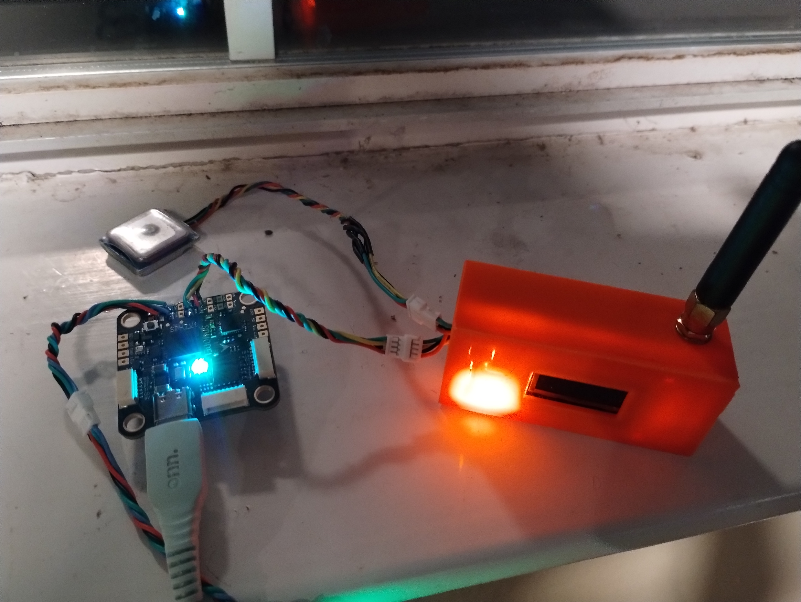

# CheapGPSTracker-Helium

This project provides code and information to build a GPS tracking
device to help find your lost drone, plane, or other item. It's built
with a $10 LORA development board.

It can listen in on an existing GPS wire that is connected to a 
flight controller, or you can use a board with a built-in GPS (about $25).

The needed hardware is a board with a LORA transmitter that be flashed with the Arduino IDE.
I built mine with a [Heltec Wifi LORA v3](https://heltec.org/project/wifi-lora-32-v3/)

I re-used the existing GPS in my model plane. To do so, I connected
only the tx wire coming from the GPS to serial2 on my board. Also of
course power and ground were connected. The tracker tees into the 
TX line coming from the GPS (to the uart rx on the flight controller).
That is to say, the GPS TX is connected to both the tracker and the
flight controller.

